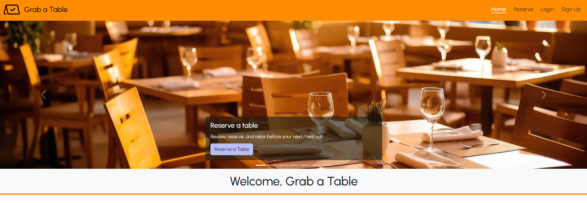

# Grab a Table

## Description
Grab a table is a restaurant listing app that allows users to find and reserve a table at a participating local restaurant.

## Features
1. **Website Menu** – Allows users to navigate Grab a Table website.
2. **Home Page** – Introduces users to Grab a Table and benefits it offers.
3. **Featured Restaurants** – Displays sponsored ads and popular local restaurants. 
4. **Restaurant Reserve Page** – Allows users to view all the restaurant listings in one place.
5. **Restaurant Listing card** – Allows users to view key inputs of the restaurant such as “Name”, “Description” and “Specialty”. 
6. **View Restaurant** – Allows users to view a detailed profile page of the restaurant.
7. **Reserve Table** - Allows users to share inputs needed to reserve a table in a restaurant and view confirmation for every successful reservation.
8. **Sign Up** – Allows users to sign up as a member of Grab a Table.
9. **Login** – Allows users to sign in as a member and access member exclusive features.

## Installation
Grab a Table is a web-based application accessible from [enter github URL]

## Usage
1. Users can access the Website Menu from the top right corner of the website. It allows users to access the following features:
    * Home Page
    * Restaurant reserve page
    * Login 
    * Sign Up
2. Users can choose a restaurant accessible from the homepage "Reserve a Table" button and restaurant listing cards accessible from restaurant reserve page.
3. Users can view detailed restaurant profile by clicking on "View Restaurant" button on restaurant listing card. 
4. Users can reserve a table in a restaurant by clicking on the "Reserve Table" button accessible from restaurant listing cards. Users see a confirmation page along with a table number reserved for every successful reservation. To reserve a table user, follow these steps –
    * Click on reserve table button
    * Full Name
    * Email address
    * Date, Time and Number of Guests
5. Users register as a member when they sign up. To sign up user, follow these steps -  
    * Click on the sign-up feature from the top menu bar. 
    * Choose a username.
    * Enter email address.
    * Choose a password.
6. Users can access member exclusive features when they login. To login user, follow these steps 
    * Click on login feature from the top menu bar.
    * Enter their username.
    * Enter password.
    * Click on sign in.

License
MIT

Contact if you have any questions, please contact – Luke Flynn, Jacqueline Nguyen, Amit Nandy and Juan 

